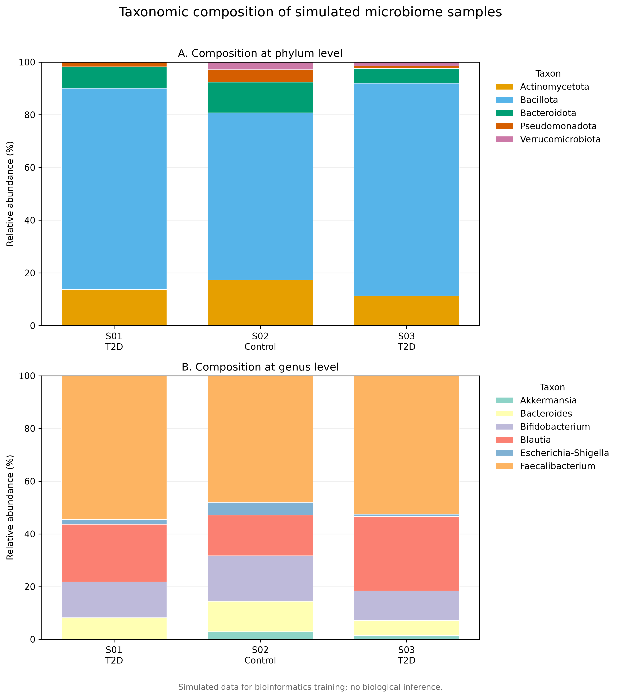
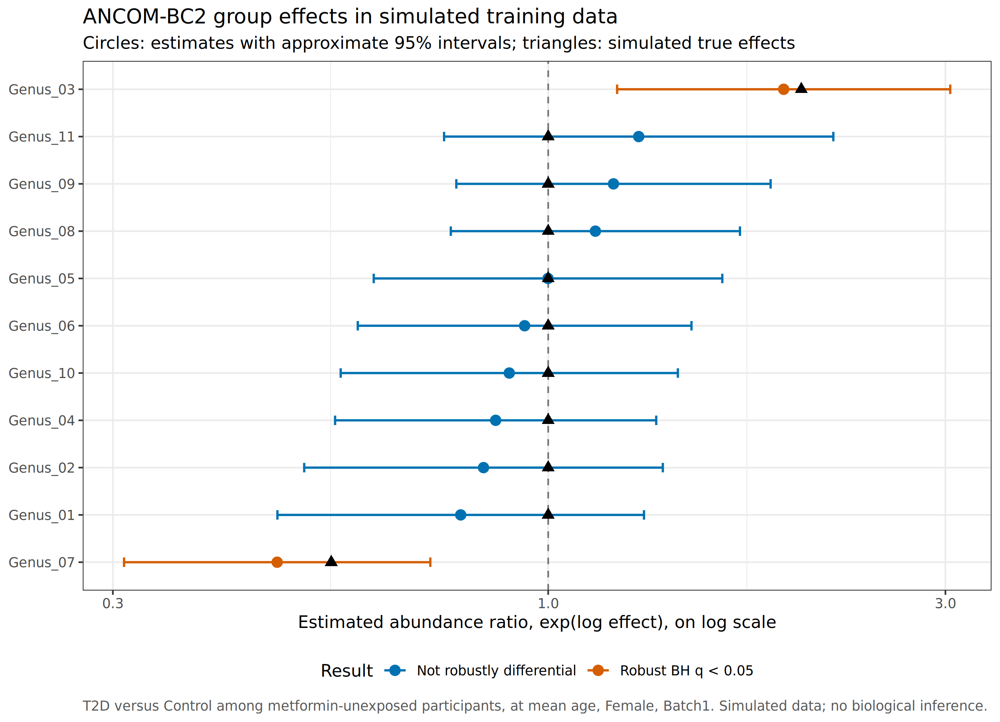
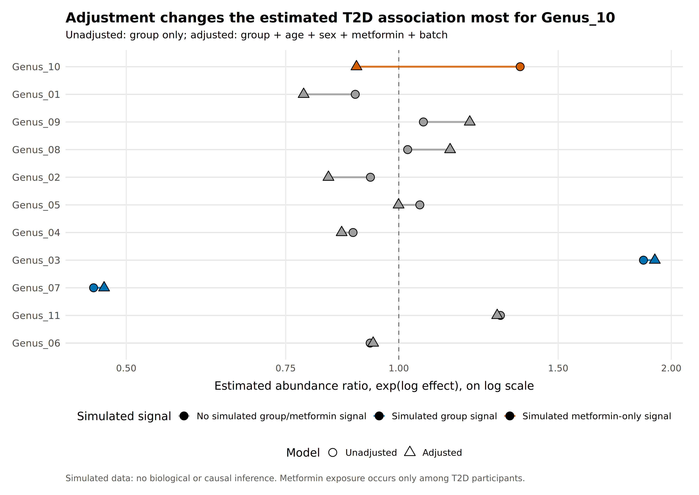
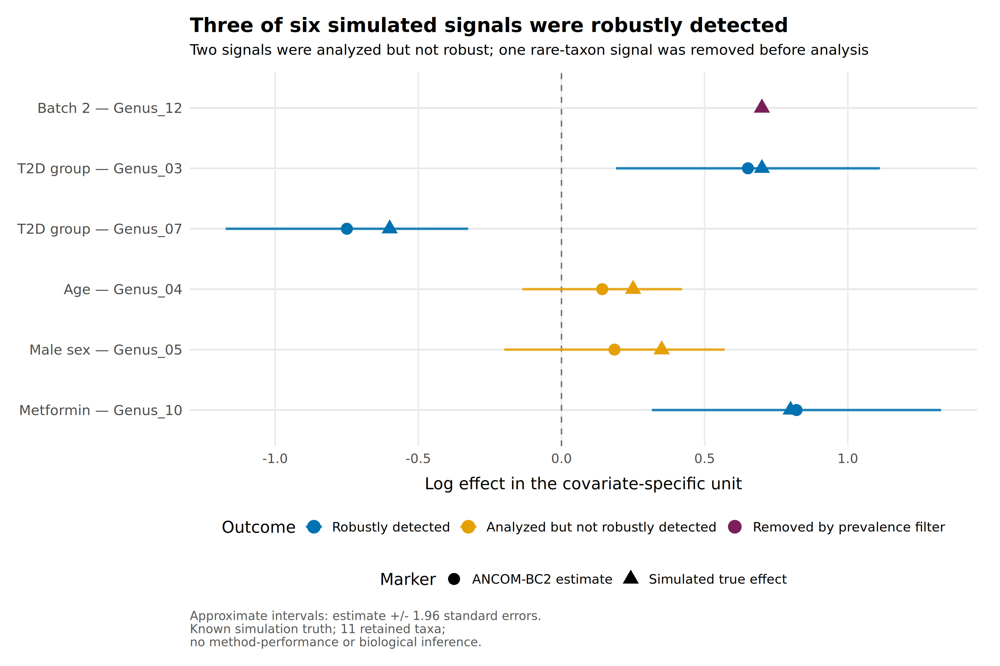
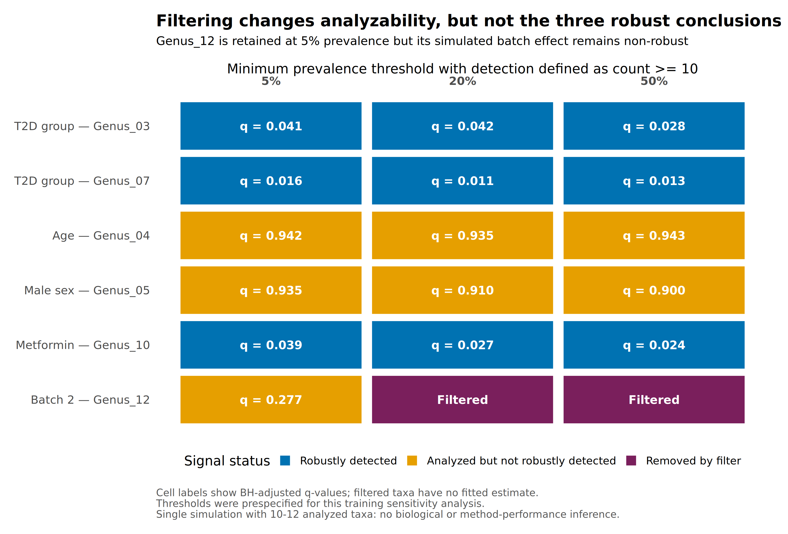

# Microbiome Bioinformatics Training

**Learner and repository owner:** Dr Guy Roussel Takuissu Nguemto
**Repository:** [microbiome-bioinformatics-training](https://github.com/guytakuissu-lang/microbiome-bioinformatics-training)

## Overview

This repository is a progressive, reproducible training project for microbiome bioinformatics. It covers input-data quality control, metadata validation, feature-table analysis, community diversity, taxonomic composition, compositional-data concepts, prevalence filtering, and multivariable differential-abundance analysis with ANCOM-BC2.

The project is designed to build analytical skills relevant to future studies of the gut microbiome, nutrition, metabolic health, and type 2 diabetes (T2D), including studies in African populations. It is a training repository, not a clinical or biological evidence base.

## Scientific interpretation boundary

The repository contains two types of training data:

1. a three-sample example dataset used to test file structures, quality-control procedures, transformations, diversity calculations, and visualizations;
2. a larger simulated dataset containing 60 samples and 12 genera, used to learn adjusted ANCOM-BC2 modelling.

Neither dataset supports biological inference about T2D or any population. Results from the simulated dataset are not evidence of real microbial associations and do not validate ANCOM-BC2 performance. The ANCOM-BC2 training analyses retain only 10–12 taxa, whereas the software warns that a substantially larger number of taxa is needed for consistent estimation of sample-specific biases.

## Learning objectives

By working through the repository, the learner should be able to:

- organize a reproducible microbiome-analysis project;
- validate FASTQ files, metadata, feature tables, sample identifiers, and taxonomy tables;
- calculate and interpret relative abundance without treating it as absolute microbial load;
- calculate alpha diversity and Bray–Curtis beta diversity;
- visualize PCoA coordinates and taxonomic composition;
- explain compositional closure, zeros, CLR transformation, and pseudocount sensitivity;
- apply and justify prevalence filtering;
- distinguish an unadjusted association from a covariate-adjusted association;
- fit and interpret an ANCOM-BC2 model using raw integer counts;
- report effect estimates, uncertainty, raw p-values, and BH-adjusted q-values;
- distinguish a signal that is not detected from a taxon removed before analysis;
- conduct sensitivity analyses without selecting thresholds after viewing preferred results.

## Repository structure

```text
microbiome_training/
├── data/       # Versioned example and simulated training data
├── docs/       # Training notes and methodological decision documents
├── figures/    # Main publication-style training figures
├── results/    # Tabular outputs, QC reports, and additional figures
├── scripts/    # Bash, Python, and R analysis scripts
├── renv/       # R environment activation and settings
├── renv.lock   # Locked R and Bioconductor package environment
├── .Rprofile   # Automatic renv activation
└── README.md
```

Raw FASTQ files are excluded through `.gitignore`. Only small, artificial training files and their reproducible outputs are versioned. Do not add participant-level, identifiable, confidential, or unpublished sensitive data to this public repository.

## Software environment

The workflow was developed in WSL Ubuntu with Python and R. The current R training environment uses R 4.6.1, Bioconductor 3.23, `renv`, ANCOMBC 2.14.0, and `ggplot2`. Exact R package versions and transitive dependencies are recorded in `renv.lock`.

The Python scripts directly import:

- `numpy`;
- `pandas`;
- `matplotlib`;
- Python standard-library modules such as `pathlib` and `sys`.

FASTQ quality-control training also uses FastQC and MultiQC.

### Clone and enter the repository

```bash
git clone https://github.com/guytakuissu-lang/microbiome-bioinformatics-training.git
cd microbiome-bioinformatics-training
```

### Python environment

```bash
python3 -m venv .venv
source .venv/bin/activate
python -m pip install --upgrade pip
python -m pip install -r requirements.txt
```

`requirements.txt` pins the direct Python dependencies used by the versioned analysis scripts. After installation, verify that the environment has no known dependency conflicts:

```bash
python -m pip check
```

FastQC and MultiQC must also be installed before repeating their respective QC modules. Installation should follow the package manager and institutional computing environment being used.

### R environment

From the repository root:

```bash
Rscript -e 'renv::restore(prompt = FALSE)'
Rscript -e 'renv::status()'
```

The project `.Rprofile` activates `renv`. If namespace-check messages concerning a package loaded before activation obscure routine output, the check can be suppressed for a single command without changing the analysis:

```bash
RENV_CONFIG_NAMESPACES_CHECK=FALSE Rscript -e 'renv::status()'
```

Run all scripts from the repository root because file paths are defined relative to that directory.

## Training modules

### 1. Input files and quality control

The first module introduces reproducible project structure and safeguards for raw data. It includes:

- FASTQ validation and FastQC/MultiQC documentation;
- metadata inspection, validation, and automated QC;
- consistency checks between sample identifiers;
- feature-table and taxonomy-table QC.

Relevant scripts include:

```text
scripts/validate_fastq.sh
scripts/summarize_metadata.sh
scripts/inspect_metadata.py
scripts/validate_metadata.py
scripts/metadata_qc.py
scripts/check_sample_ids.py
scripts/feature_table_qc.py
scripts/taxonomy_qc.py
```

Interpretive notes are available in `docs/fastqc_analysis.md` and `docs/multiqc_analysis.md`.

### 2. Metadata exploration

```bash
python scripts/explore_metadata.py
python scripts/plot_age_by_group.py
```

These scripts demonstrate descriptive exploration and group visualization. With the three-sample example dataset, outputs are illustrative only and cannot support group inference.

### 3. Relative abundance and community diversity

```bash
python scripts/calculate_relative_abundance.py
python scripts/plot_relative_abundance.py
python scripts/calculate_alpha_diversity.py
python scripts/plot_alpha_diversity.py
python scripts/calculate_beta_diversity.py
python scripts/plot_pcoa.py
```

Key outputs include:

- `results/alpha_diversity.tsv`;
- `results/bray_curtis_distance.tsv`;
- `results/pcoa_coordinates.tsv`;
- `figures/pcoa_bray_curtis.png`.

The three-sample PCoA is a calculation and visualization exercise. It must not be interpreted as evidence of separation between T2D and Control groups.

### 4. Taxonomic aggregation and composition

```bash
python scripts/taxonomy_qc.py
python scripts/aggregate_taxonomy.py
python scripts/plot_taxonomic_composition.py
```

The workflow validates taxonomic identifiers, aggregates counts at phylum and genus levels, converts them to relative abundance, checks that sample-wise percentages sum to approximately 100%, and produces a stacked-composition figure.



### 5. Compositionality, zeros, and CLR transformation

```bash
python scripts/demonstrate_compositionality.py
python scripts/calculate_clr.py
python scripts/assess_clr_pseudocount_sensitivity.py
```

This module demonstrates that an unchanged taxon can show a lower relative percentage when another taxon increases. It then applies a centered log-ratio transformation and examines sensitivity to pseudocount values.

Important cautions:

- CLR values are log-ratio coordinates, not percentages;
- pseudocount choice can strongly affect cells containing observed zeros;
- no pseudocount is universally appropriate;
- zero handling must match the downstream statistical method.

### 6. Prevalence filtering

```bash
python scripts/assess_taxon_prevalence.py
python scripts/assess_filter_sensitivity.py
```

The training filter illustrates detection and prevalence thresholds. Thresholds in this module are arbitrary teaching choices. In a real study, filtering rules should be prespecified, scientifically justified, and accompanied by sensitivity analyses because rare but relevant taxa can be removed.

### 7. Differential-abundance method selection

The methodological rationale is documented in:

```text
docs/differential_abundance_method_selection.md
```

The training strategy uses ANCOM-BC2 as the primary method because it accepts raw integer counts, incorporates covariates, and addresses microbiome-specific bias under its assumptions. Percentages or manually calculated CLR values are not supplied to ANCOM-BC2.

For a future real T2D study, covariate choice must follow the scientific estimand and a causal framework. Age, sex, site, batch, antibiotics, diet, stool consistency, adiposity, and medication may have different causal roles. Metformin requires particular attention because it is strongly related to T2D treatment and may also be related to microbiome composition.

### 8. Reproducible ANCOM-BC2 training workflow

#### Environment check, simulation, and QC

```bash
Rscript scripts/check_ancombc_environment.R
Rscript scripts/simulate_ancombc_training_data.R
Rscript scripts/qc_ancombc_training_data.R
```

The simulation contains 60 samples, balanced T2D and Control groups, covariates, 12 genera, known artificial effects, and a deliberately sparse genus. Simulation truth is stored separately in `data/simulated_ancombc_truth.tsv`.

#### Adjusted primary model

```bash
Rscript scripts/run_ancombc2_training.R
Rscript scripts/plot_ancombc2_training_group_results.R
```

The fitted training model is:

```text
group + age_centered + sex + metformin + batch
```

The `groupT2D` coefficient is a conditional comparison of T2D with Control at mean age and the reference levels Female, no metformin, and Batch1. It is not a marginal population-wide T2D effect.

The model robustly recovered the two simulated group effects:

- `Genus_07`: negative artificial group effect;
- `Genus_03`: positive artificial group effect.

These are known simulation results, not biological findings.



#### Unadjusted versus adjusted comparison

```bash
Rscript scripts/compare_ancombc2_adjustment.R
Rscript scripts/plot_ancombc2_adjustment_comparison.R
```

The comparison shows that adjustment can materially change an estimated association even when it does not change the list of robust discoveries. `Genus_10`, which has an artificial metformin effect but no simulated group effect, shows the largest estimate change after adjustment. It is not significant in either model and must not be described as a false positive.



#### Recovery of known simulated signals

```bash
Rscript scripts/evaluate_ancombc2_signal_recovery.R
Rscript scripts/plot_ancombc2_signal_recovery.R
```

Of six encoded signals:

- three were robustly detected;
- two were analyzed but not robustly detected;
- one was removed by the prevalence filter.

Failure to detect a simulated signal is not evidence of absence. A taxon removed before modelling cannot be classified as statistically non-significant because it was never tested.



#### Sensitivity to prevalence filtering

```bash
Rscript scripts/assess_ancombc2_filter_sensitivity.R
Rscript scripts/plot_ancombc2_filter_sensitivity.R
```

This module compares minimum prevalence thresholds of 5%, 20%, and 50%, with detection defined as a count of at least 10. The same adjusted model is fitted at every threshold.

The sparse `Genus_12` is retained at 5% but its artificial batch effect remains non-robust. It is removed at 20% and 50%. The same three signals remain robust across the three thresholds, but this single small simulation does not establish general robustness.



## Main methodological safeguards

1. Use raw integer counts for ANCOM-BC2, not percentages or externally calculated CLR values.
2. Define the estimand, taxonomic level, covariates, contrasts, filtering rules, and multiplicity correction before inspecting preferred results.
3. Verify sample independence or model repeated measurements explicitly.
4. Treat medication, diet, adiposity, and metabolic biomarkers according to their causal roles rather than adjusting automatically for every available variable.
5. Distinguish relative abundance from absolute microbial load.
6. Report effect estimates and uncertainty, not only significant-taxon lists.
7. Report null findings, filtered features, sensitivity analyses, and method disagreement.
8. Assess contamination, batch effects, influential observations, group imbalance, sequencing depth, zeros, and reference-database dependence.
9. Validate important findings in independent data or with targeted assays where feasible.
10. Do not infer method performance from a single small simulation.

## Reproducibility checks

Before committing a completed module:

```bash
Rscript -e 'renv::status()'
git diff --check
git status
```

After staging files:

```bash
git diff --cached --check
git diff --cached --stat
```

Generated tables and figures are retained in this training repository to make each analytical step auditable. Real research projects may adopt a different output-versioning policy based on data sensitivity, file size, computational cost, and institutional requirements.

## Current limitations and next development priorities

- The basic example dataset contains only three samples.
- The ANCOM-BC2 simulation contains only 12 genera and is unsuitable for performance benchmarking.
- Only one simulated realization has been analyzed.
- No independent biological dataset is included.
- The repository does not yet implement contamination-aware low-biomass workflows, repeated-measures designs, shotgun metagenomics, virome analysis, or workflow orchestration with Nextflow.

The next methodological priority is a larger, repeated simulation with more than 50 taxa, prespecified performance metrics, and multiple scenarios for sparsity, effect size, treatment imbalance, and filtering. This should precede any claim about power, false-discovery control, or comparative method performance.

## Primary references and documentation

- Lin H, Peddada SD. [ANCOM-BC2](https://doi.org/10.1038/s41592-023-02092-7). *Nature Methods*.
- [ANCOMBC Bioconductor manual](https://bioconductor.org/packages/release/bioc/manuals/ANCOMBC/man/ANCOMBC.pdf).
- Mallick H et al. [MaAsLin2](https://doi.org/10.1371/journal.pcbi.1009442). *PLOS Computational Biology*.
- [ALDEx2 Bioconductor vignette](https://bioconductor.org/packages/release/bioc/vignettes/ALDEx2/inst/doc/ALDEx2_vignette.html).
- Zhou H et al. [LinDA](https://doi.org/10.1186/s13059-022-02655-5). *Genome Biology*.
- Nearing JT et al. [Comparison of differential-abundance methods](https://doi.org/10.1038/s41467-022-28034-z). *Nature Communications*.

## Responsible use

All analytical code, outputs, interpretations, and references should be independently checked before use in a manuscript, grant application, policy document, or clinical/public-health decision. This repository supports training and reproducibility; it does not replace expert statistical review, domain interpretation, ethics oversight, or validation with appropriate real-world data.
